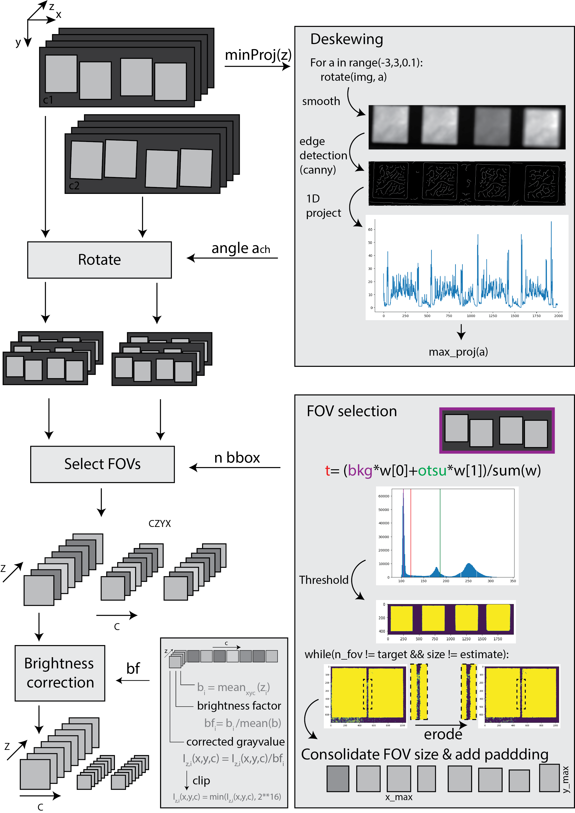
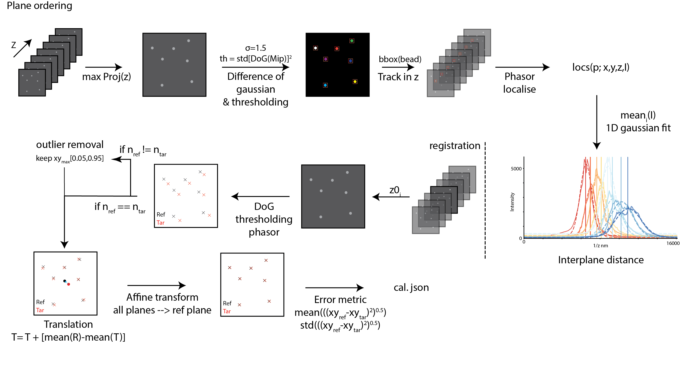

# mp_proc
Code to calibrate and process data created in multiplane imaging OME, KG Lab, TU Delft written in python, shipped with an example jupyter notebook.  

## Installation

- Use Terminal (MacOS) or Cmd (Win). Use cd to navigate to the target directory. (e.g. cd git)
- Clone this repository to a folder of your choice

`git clone https://github.com/moengels/mp_proc.git` 

- Enter the git folder
`cd mp_proc `

- Create a new virtual environment via the requirements file

    conda create --name mp-env --file requirements.txt
    conda activate mp-env`

## Basic interaction

Check main_processing.ipynb on how to process raw frames.  

## Short description
The code takes raw NDTiff or MMStack .tiff files created from the multiplane system via Micro-Manager (version 2.0.gamma or older).
First step is to create a calibration file that describes the coordinates of the individual planes on the sensor(s), the individual brightness correction factors, affine transforms and axial separation. 
A calibration file (cal.json) is created by running a z-stack of immobilised bright beads of subdiffraction limited size and similar wavelength to the application through the MultiplaneProcess.calibrate function. 
This calibration file can subsequently be used to process data created with the same optical configurations to separate, co-register and brightness correct individual planes and save them with the appropriate metadata to chunks of .tiff files. 

### First steps to adapt to your system (Micro-Manager run system)
Create an instance of the MultiplaneProcess
    
    from multiplane import MultiplaneProcess
    p = MultiplaneProcess()

update the parameters specific to your system, in particular: 

    p.P['pxlsize']= 108 #nm `
    p.P['ncams']=2 #how many detectors used `
    p.P['nplanes']= 8 # how many planes across all cameras`
    p.P['order_default']= [2,3,0,1] # default order of planes after cropping, order: camera, coordinates (left to right, top to bottom)`
    p.P['flip_cam'] = [False, True] # bool, whether to flip the camera data (assuming there are 2 cameras)`
    p.P['ref_plane'] = 2 # reference plane to which affine transform is determined, should be within range`

### First steps to adapt to your system (non- Micro-Manager data)

Adapt all the above. 
In addition, you either write your own metadata parser (see current version under utils/metadata.py) or adjust the relevant parameters for each processing instance:
 
    p.P['dz_stage']=  100 #nm, zstage displacement per frame during calibration 
    p.file_extensions = [your_fileformat]

## Calibration
Upon selecting a data directory and running the calibration function the scripts looks for a Micro-manager specific metadata file (filename_metadata.txt), parses it and updates the processing parameters as far as possible.
In addition, it looks for an existing calibration file (cal.json) and checks whether there are parameters missing in that file. 
The following steps can all individually be (de)selected by changing the respective boolean flag. 
The input data for calibration is assumed to be a 4D stack of dimension (Z,C,X,Y) with Z being the steps in depth by the stage, and C the camera channel.  
If more than one camera is used, but the additional camera(s) are saved in frame sequence with the others (=3D stack: [Z1C1XY, Z1C2XY, Z1C1XY,...] ), the 3D stack is sliced into the correct format based on the parameter P['ncams'].

### Deskewing
Initially, each individual camera is assesed for global skew of the illuminated areas on the sensor. This used to be a source of error in cropping as this can cause overlapping FOVs of the indivudal planes assuming a rectangular bounding box. The tilt angle is determined by running a canny edge detection on the median z-projection of the stack, then summing the assumed outline of the illuminated areas to a 1-d distribution in x. A range of potential tilt angles is sampled, whereby the one yielding the highest count of edge pixels along an axis is the supposed best rotation angle. 

### FOV selection
Image planes on the sensor need to be identified. Thresholding is an obvious approach to it, threshold selection is however not trivial. As the brightness across image planes varies depening on the imaging wavelength, a global otsu-threshold can fail by interpreting differently bright planes as the distributions to separate and not signal to background. 
A simple background estimation by taking the median value of pixels of the outer frame and weighing it with an otsu threshold estimate appeared to be a robust initial estimator. 
As the edges of slightly defocussed planes blur, it can cause two neighbouring planes to be merged via a small 'bridge'. Hence an iterative eroision of the identified FOVs is conducted until the correct amount of image planes is found. Should this fail and no FOVs are detected or the max amount of iteratiosn is reached, a re-thresholding is conducted by dividing the last threshold by 2 and repeating the erosion process. 

The found coordinates are now checked for size differences between FOVs and adjusted to the maximum size in (x,y) and yield equally sized crops to be able to save them into numpy arrays. 

### Brightness correction
Wavelength dependent splitting ratios of the prism interfaces yield different intensity differences on the actual sensor. This is naively corrected by calcualting the mean value across the whole stack of an individual image plane and normalising by the mean value of all brightness means.
Correction is then conducted by dividing the grayvalues in each stack by that correction factor and checking for clipping it to a 16-bit encoding.

### Plane order and interplane distance
To identify the axial order and spacing of focal planes, beads are identified in the max-projection of each subimage in z, with a difference-of-gaussian filter ($\Sigma$=1.5) employing a subimage specific dynamic threshold (th=var(Dog)). At the identified bead candidate ROIs in xy, each substack is evaluated per plane for the super-resolved position and intensity of the bead via phasor-localisation (see Martens et al., 2018). The intensity traces for each bead in z are averaged, and a 1-d gaussian is fit to determine the relative focal planes for each subimage. 

### Registration
We tried a battery of registration approaches to co-align the subimages. The figure belows outlines the old approach using bead idenitification (=marker) at the respective focal plane via phasor-localisation, a marker-selection process via mean-coordinate pre-shifting and coorindate outlier rejection if marker counts between reference and target image do not correspond. 
Subsequently and affine transform that minimises spatial separatino across markers is caluclated via the openCV package. We employ a reference plane that can be set via P['ref_plane'] as one of the central planes to register to (instead of iterative pairwise registration). 

In addition, a spatial distance check is conducted that relates relative to abolute distances of markers to evaluate whether there are magnification changes between the subimages (mostly due to misalingment in the 4f system).   

### Outputs
The calibration writes a calibration file (cal.json) to the data directory and creates a subfolder /cal_data wherein a graph for the interplane distance and the co-registered calibration data is stored. 

## Processing
the MultiplaneProcess.execute function, converts the raw data into a co-registered stack. It requires a cal.json file and a data-directory. 
It takes an arbitrary amount of .tif(f) stacks and uses frame-batches (set by P['dF_batch']) to avoid RAM errors. 
TODO: Convert to memory mapping. 

